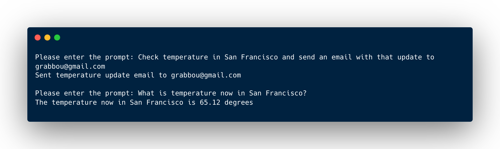

# Basic agent example

## Preview

Here is a snapshot of a terminal session, where you can see the agent in action. For the purpose of the example, the entry point was designed as a chat-like interface rather than a single endpoint.

